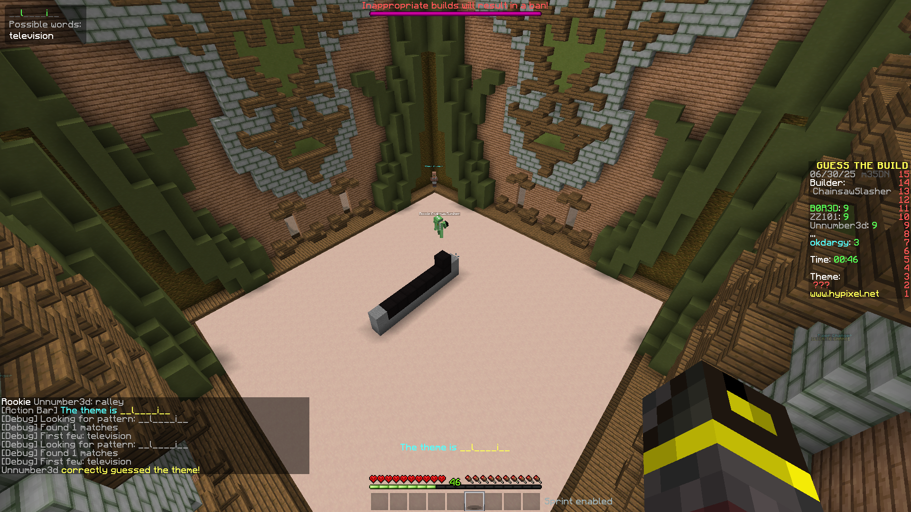

# GTBSolver

## Introduction

GTBSolver monitors the action bar for Build Battle word clues (the ones with underscores like "___e") and instantly provides a list of possible words that match the pattern.

## Screenshots

Click to view screenshot

## Installation

1. Make sure you have Minecraft Forge 1.8.9 installed
2. Download the latest release from the releases page
3. Place the `.jar` file in your `mods` folder
4. Launch Minecraft and enjoy!

## Warning

Hypixel does not allow blacklisted modifications/mods that provide an unfair advantage. **Use this mod at your own risk.**

## TODO 

- [ ] Better idle edge case handling (Player leaving the game)
- [ ] Add better prediction logic based on block placement
- [ ] Further automation features (e.g., auto-typing words, sound notifications when it's your turn)